# ProfLink: A Professional Social Media Web App
## Introduction
**A social media web app for professionals. Built with React.js for front-end and Express.js, Node.js and MongoDB for back-end.**
## Features
- **`Create-Post`: Share articles, news, updates, and professional achievements with your network.**
- **`Like`: Engage with posts by liking them.**
- **`Follow System`: Stay updated with industry leaders, colleagues, or any professional of interest.**
- **`Profile View`: Browse profiles of other professionals and see their professional journey.**
- **`Edit & Delete`: Full control over your posts and profile information.**
## Tech Stack
- **`Frontend`: React.js.**
- **`Backend`: Node.js, Express.js, and MongoDB.**
## Screenshots
### Signup Page
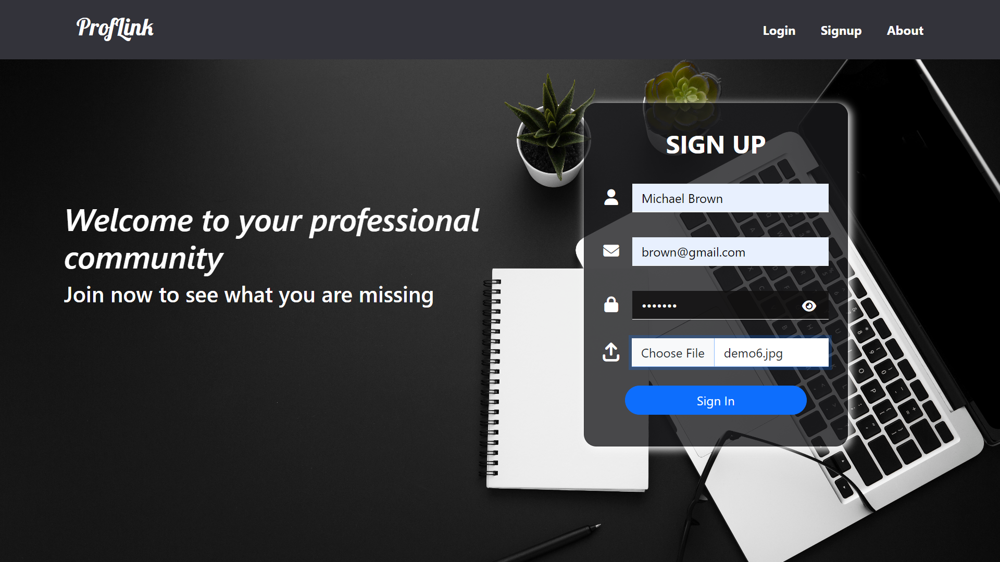
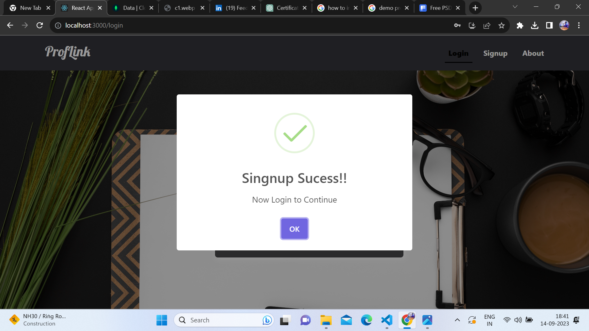
### Login Page
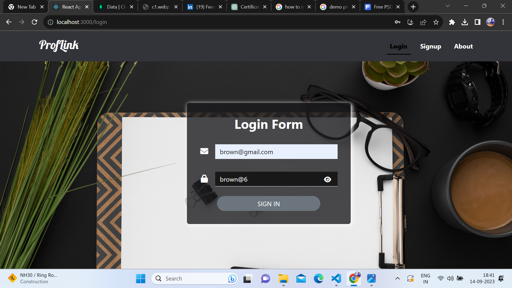
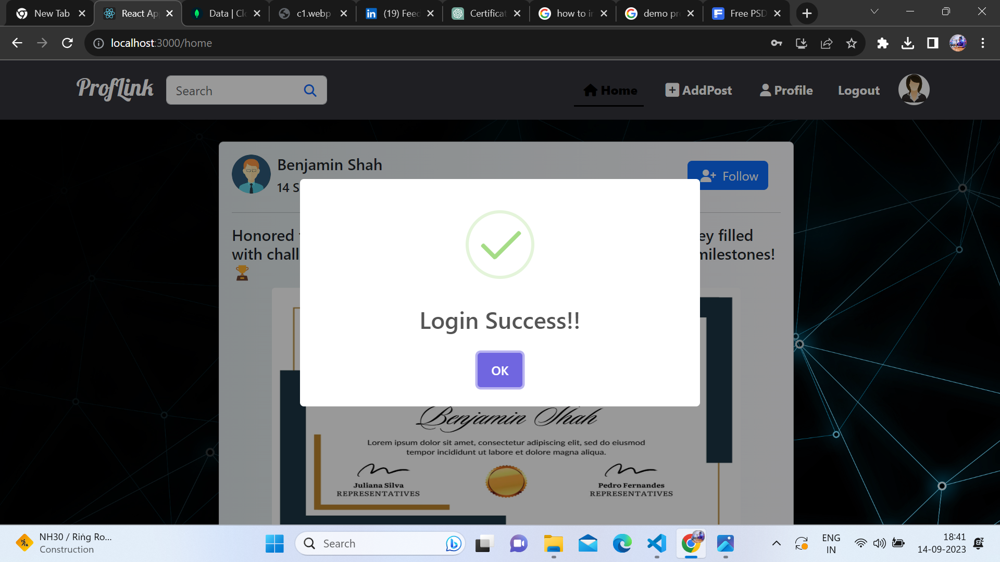
### Home Page
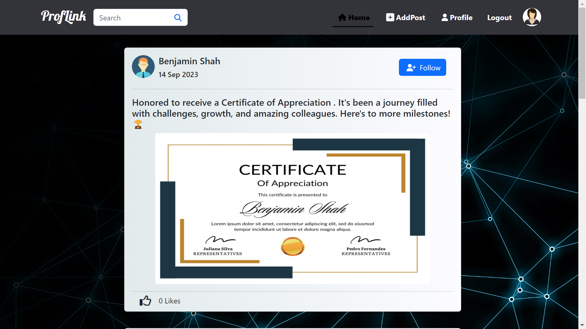
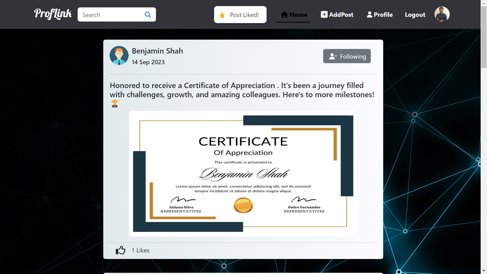
### Create Post
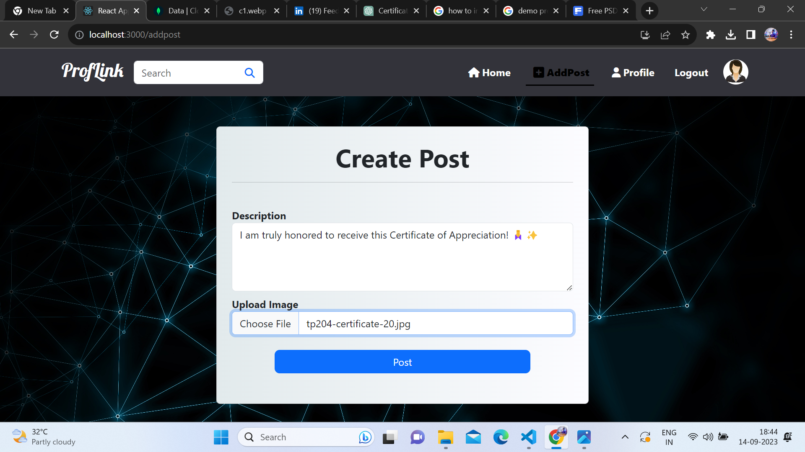
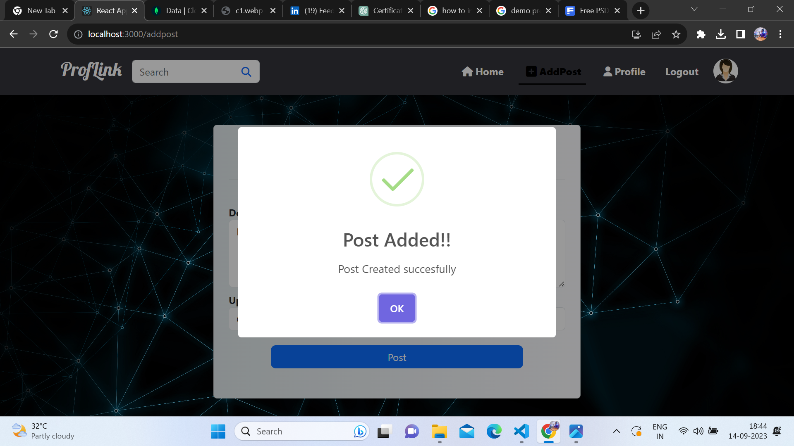
### Edit Post
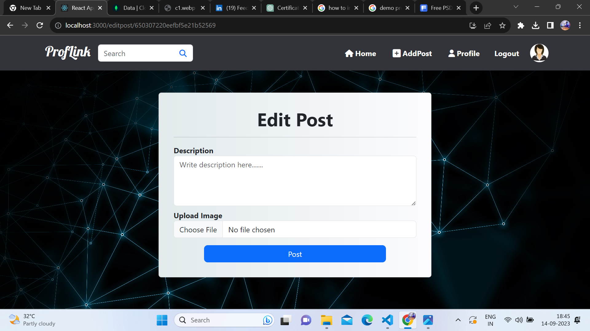
### User Profile

### Search User
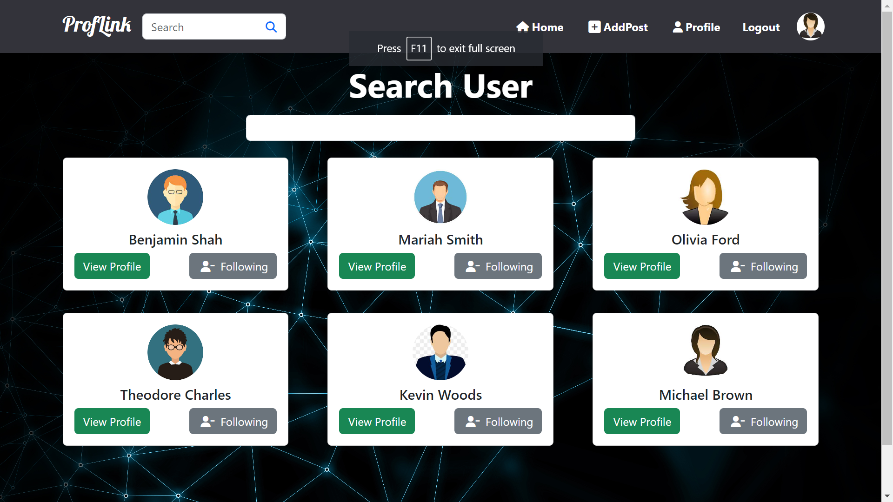
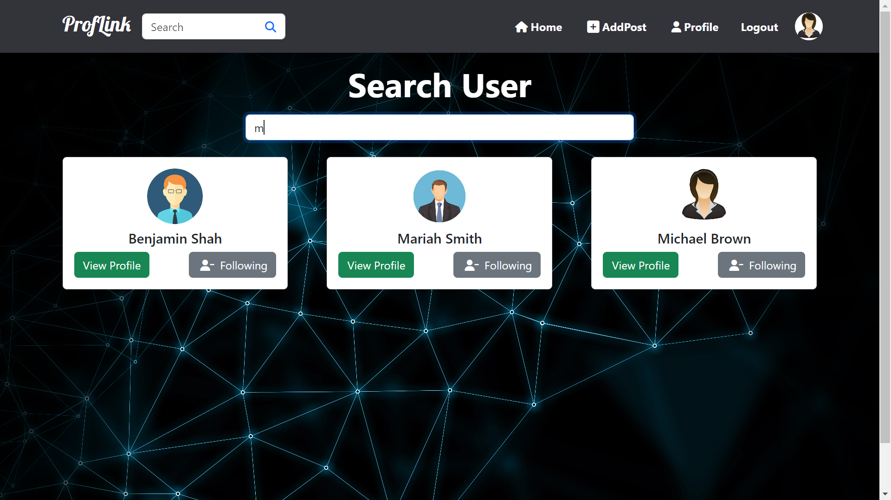
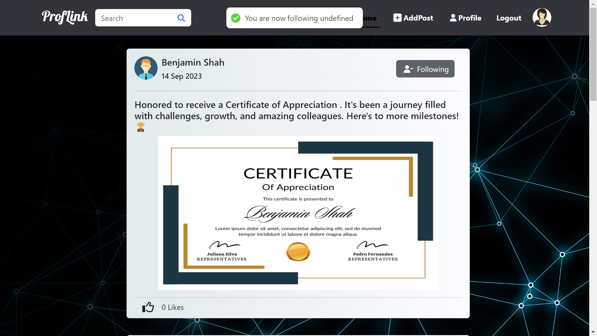

